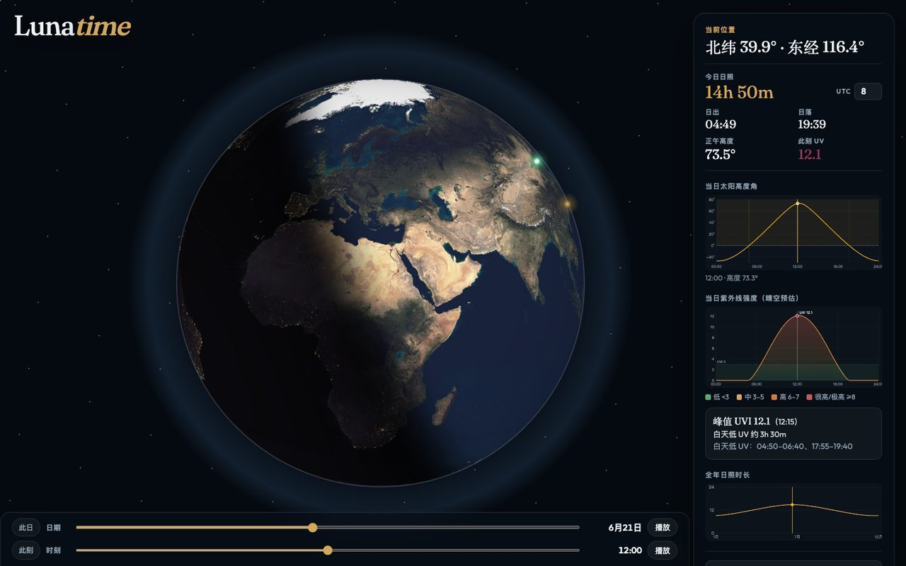

# Lunatime

*The Guide’s entry for Earth is famously short. This is the longer, less official footnote about daylight.*

点一下地球，立刻得到（在误差允许的宇宙范围内）：

- **日照时长**，以及日出 / 日落——若该地今天仍承认「白天」这一概念
- **太阳高度**曲线：恒星在天空中的日行程，不含情绪
- **紫外线指数**估算，附带**白天低 UV**时段
- 时区、日期、时刻可调；你的选择会被记住，因为遗忘是行星的事，不是玩具的事

另外还有这些，指南没写进正典、但很有用：

- **右键选城**：地球上右键，列出附近 500 km 内的城市（不会误改当前选点）
- **位置对比 + 经度对齐**：把两地叠在同一条日照曲线上比一比
- **城市搜索 / 定位**：搜城名，或一键跳到「你大概在这儿」
- **节气**：日期轴上的二十四节气小标记
- **夜景灯光**：夜半球上的城市灯火（NASA 夜景风格）

单文件 `index.html`。无后端。无账号。无「请先阅读四十二页条款再仰望苍穹」。

## 怎么开

**直接打开就行：** [shuikun0.github.io/lunatime](https://shuikun0.github.io/lunatime/)

无需安装，无需服务，无需向本地环回地址解释存在主义。浏览器能上网，你就能晒（模拟地晒）。

若你偏爱亲手端着源码：打开仓库里的 `index.html` 即可。只有在浏览器对 `file://` 使性子时，才需要 `python3 -m http.server` 这类本地静态服务——那是备用轮胎，不是旅程本身。

## 关于数字

它们是教育用近似值：足以培养一种体面的直觉，却不足以替你决定是否涂防晒、是否出门，或是否继续与一颗持续进行热核反应的球体保持目前这种单方面关系。

别拿去打官司。恒星不会出庭，律师费却会。
